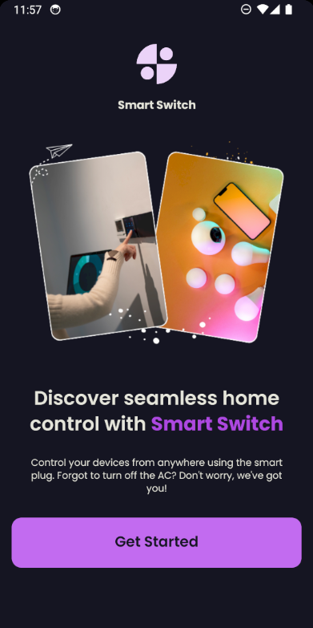
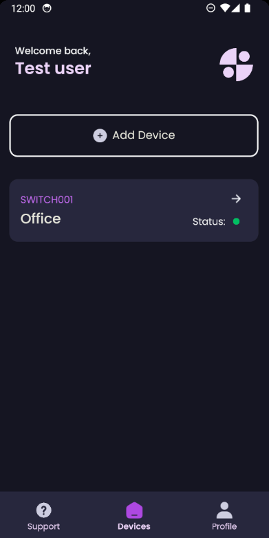
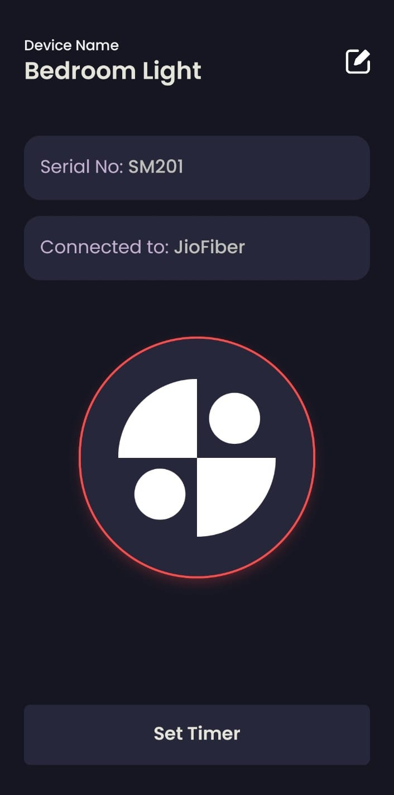

# Smart Switch

Smart Switch is a cross-platform mobile application designed to revolutionize home automation. It allows users to remotely control and automate home appliances, ensuring convenience and energy efficiency.

---

## Features

### 🌟 Key Features
- **Remote Device Control:** Seamlessly control and automate your home appliances from anywhere.
- **User Authentication:** Secure access with user login and registration.
- **Cross-Platform Compatibility:** Runs smoothly on both Android and iOS devices.
- **Real-Time Communication:** Uses MQTT protocol for communication with hardware devices.
- **Intuitive UI:** Designed for enhanced user engagement and satisfaction.

### 🔧 Backend Highlights
- **Node.js & Express:** Robust and scalable server architecture.
- **MongoDB:** Reliable database for storing user data and device configurations.

---

## Snapshots

 &nbsp;&nbsp;  &nbsp;&nbsp; 

---

## Technology Stack

### Frontend
- **React Native:** For building the mobile application.
- **Expo:** For efficient dependency management.
- **Nativewind:** Tailwind CSS package for native development.

### Backend
- **Node.js** and **Express.js:** For API and server-side logic.
- **MongoDB:** For database management.
- **MQTT:** For real-time communication with the IoT device.

---

## Setup and Installation

### Prerequisites
Ensure you have the following installed:
- **Node.js**
- **npm** or **yarn**
- **MongoDB**
- **React Native CLI**

### Steps to Run the Client Application

1. **Clone the Repository**
   ```bash
   git clone https://github.com/srijitt/smart-switch.git
   cd smart-switch-app
   ```

2. **Navigate to the Frontend Directory**
   ```bash
   cd client
   ```

3. **Install Dependencies**
   ```bash
   npm install
   ```

4. **Start the Application**
   ```bash
   npx expo start --clear
   ```

5. **Run the Application on Your Device**
   - Use the Expo Go app to scan the QR code displayed in the terminal or browser.
   - Alternatively, use an emulator for Android/iOS to test the app.

---

## Workflow

1. **Authentication:**
   - Users sign up or log in to the app.
   - Users then configure their device with the app.

2. **Device Control:**
   - The app communicates with the IoT hardware (switch) via the MQTT protocol.

3. **Backend Processing:**
   - The backend processes requests and manages user/device data.
   - Database is updated realtime so as to ensure consistency in device control.

---

## License

This project is licensed under the [MIT License](LICENSE).

---

## Acknowledgements

Special thanks to the collaborators and stakeholders who contributed to the design and development of this project.
