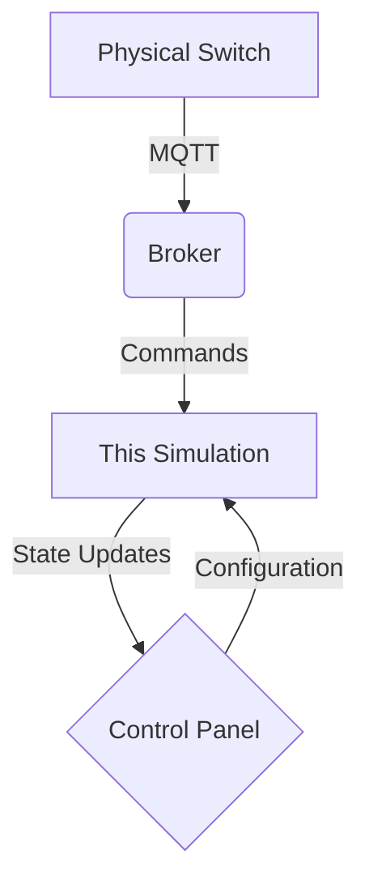

Here's a professional README.md for your hardware simulation script:

---

# Smart Switch Hardware Simulation

📂 `hardware-simulation-script/`  
**Template for ESP8266/ESP32 Based IoT Smart Switches**

---

## 🧠 Overview
This directory contains the **reference implementation** for smart switch firmware communicating with our IoT control system. While each physical switch has device-specific code (unique client IDs, security credentials, and GPIO mappings), this template demonstrates the core functionality common to all devices in the ecosystem.

---

## 🔧 Key Features
1. **MQTT Protocol Implementation**
   - Secure WebSocket communication (`wss://`)
   - TLS encryption for all messages
   - Authentication with unique client credentials

2. **Dual Command Support**
   ```json
   {
     "type": "config",  // WiFi credentials update
     "ssid": "HomeNet",
     "password": "securepass123"
   }
   ```
   ```plaintext
   ON  // Toggle command
   OFF // Toggle command
   ```

3. **Simulation Modes**
   - Hardware state visualization
   - WiFi configuration simulation
   - GPIO interaction mocking

---

## 🛠 Customization Guide
To adapt for new switches (e.g., SM102):

1. **Modify Device Parameters**
   ```python
   # ======= DEVICE IDENTITY ======= #
   TOPIC = "SM707"  # Change to unique switch ID (e.g., SM102)
   CLIENT_ID = "SMART_SWITCH_SIM_01"  # Unique client identifier
   ```

2. **Add Hardware-Specific Logic**
   ```python
   # ======= HARDWARE MAPPING ======= #
   RELAY_PIN = 5  # Change based on GPIO layout
   LED_PIN = 4    # Status indicator pin
   ```

3. **Security Customization**
   ```python
   # ======= AUTHENTICATION ======= #
   USERNAME = "device_sm707"  # Per-device username
   PASSWORD = "unique_encryption_key"  # Per-device secret
   ```

---

## 🚀 Quick Start
1. **Install Dependencies**
   ```bash
   pip install paho-mqtt
   ```

2. **Run Simulation**
   ```bash
   python smart_switch_sim.py
   ```

3. **Test Commands**
   - Toggle switch:
     ```bash
     mosquitto_pub -h broker.hivemq.com -p 8884 -t SM707 -m "ON" -u stephen -P stephenmqtt --capath /etc/ssl/certs -V mqttv311 -d
     ```
   - Configure WiFi:
     ```bash
     mosquitto_pub -h broker.hivemq.com -p 8884 -t SM707 -m '{"ssid":"HomeNet","password":"p@ssw0rd"}' -u stephen -P stephenmqtt --capath /etc/ssl/certs -V mqttv311 -d
     ```

---

## 📁 Project Structure
```
hardware-simulation-script/
├── smart_switch_sim.py    # Main simulation script
├── config_examples/       # Sample device configurations
│   ├── SM101_config.json
│   ├── SM102_config.json
│   └── SM103_config.json
└── docs/                  # Hardware integration guides
    ├── gpio_mapping.md
    └── security_protocol.md
```

---

## 🔄 Workflow Diagram
